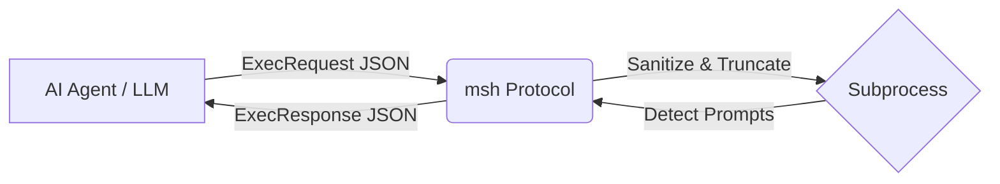

# msh (Machine Shell)

> The Deterministic Execution Protocol & Runtime for AI Agents.

`msh` is an open-source execution layer built specifically for autonomous coding agents, LLM tool-use systems, and agentic workflows. Instead of forcing AI models to parse unstructured, ANSI-polluted terminal streams, `msh` provides a machine-readable execution environment with strict state preservation, automated log sanitization, and structured JSON output.

## Why msh?

When an AI agent runs `npm run build`, it usually receives a raw stream of ANSI escape codes, progress bars, and unstructured text. If the command asks a `[y/N]` question, the agent hangs forever.

`msh` acts as a protective runtime between the agent and the OS:
- **Returns Structured JSON** — Everything is an `ExecResponse`.
- **Sanitizes Output** — Strips all ANSI codes and progress bars.
- **Prevents Context Blowouts** — Automatically truncates massive error dumps (keeps first 100 + last 100 lines).
- **Detects Prompts** — Kills the process and returns `"status": "blocked"` if a `[y/N]` or password prompt appears.
- **True Terminal Emulation** — Supports executing commands inside a Pseudo-Terminal (PTY) via `use_pty: true` for tools that demand a TTY.
- **Network Daemon** — Run `msh serve` to expose an HTTP REST API, allowing remote agents to manage stateful execution sessions over the network.
- **MCP Server** — Run `msh mcp` to natively expose the runtime to any Model Context Protocol compatible AI IDE (like Claude Desktop or Cursor).
- **Filesystem Diffing** — Returns exactly which files were added, modified, or deleted during the command.

`msh` solves the execution layer so agent builders can focus entirely on the intelligence layer.

---

## Architecture

At its core, `msh` intercepts everything that happens inside a subprocess.



---

## Getting Started

### 1. CLI Usage (`msh exec`)

Run any command and get a completely deterministic, heavily structured JSON payload back.
```bash
msh exec "npm run build" --max-lines 500
```
Returns: `{"session_id":"agent-123", "cwd":"/project/src", "stdout":"main.go...", ...}`

### 2. CLI Wrapping (`msh wrap`)

Need to use `msh` in an existing bash script or for a human developer where JSON is annoying? Use `wrap`.
It runs exactly the same deterministic execution engine but prints the clean, truncated text directly to the terminal!
```bash
msh wrap "npm run build" --max-lines 500
```
*Outputs beautifully truncated text with ANSI color codes stripped out!*

```json
{
  "status": "success",
  "exit_code": 0,
  "cwd": "/workspace/app",
  "stdout": "Build completed successfully.",
  "stderr": "",
  "truncated": false,
  "files_changed": ["dist/main.js"],
  "duration_ms": 420
}
```

#### 2. HTTP Daemon (Stateful Network Sessions)

Start the server:
```bash
msh serve --port 8080
```

Agents can now submit JSON requests over HTTP. By passing a `session_id`, `msh` remembers the working directory across multiple REST requests!

**Request 1 (Create Session & Change Directory):**
```bash
curl -X POST http://127.0.0.1:8080/execute \
  -d '{"command": "cd src", "session_id": "agent-123"}'
```
Returns: `{"session_id":"agent-123", "cwd":"/project/src", ...}`

**Request 2 (Execute in that Directory):**
```bash
curl -X POST http://127.0.0.1:8080/execute \
  -d '{"command": "ls", "session_id": "agent-123"}'
```
Returns: `{"session_id":"agent-123", "cwd":"/project/src", "stdout":"main.go...", ...}`

### 4. MCP Server (Native Integration)

Start the server using Standard I/O (this is how you configure Claude Desktop or Cursor to use it):
```bash
msh mcp
```

Example `claude_desktop_config.json`:
```json
{
  "mcpServers": {
    "msh": {
      "command": "msh",
      "args": ["mcp"]
    }
  }
}
```
*Claude will now instantly have access to a deterministic `execute_command` tool!*

### Request Fields

| Field | Type | Description |
|-------|------|-------------|
| `command` | `string` | Shell command to execute (required). |
| `cwd` | `string` | The directory to execute the command in. Defaults to session directory. |
| `env` | `object` | Key-value pairs of environment variables to inject. |
| `timeout` | `string` | Maximum execution time before being killed (e.g., `30s`, `1m`). |
| `max_output_lines` | `integer` | Truncates output if it exceeds this (saves tokens). |
| `detect_files` | `boolean` | If true, returns exactly which files were modified. |
| `use_pty` | `boolean` | If true, runs the command in a Pseudo-Terminal (merges stderr into stdout). |

### Response Fields

| Field | Type | Description |
|-------|------|-------------|
| `status` | string | `success`, `error`, `timeout`, or `blocked` |
| `exit_code` | int | Process exit code |
| `cwd` | string | Working directory after execution |
| `stdout` | string | Sanitized standard output (ANSI stripped) |
| `stderr` | string | Sanitized standard error (ANSI stripped) |
| `truncated` | bool | Whether output was truncated to save tokens |
| `files_changed` | []string | Files added, modified, or deleted |
| `duration_ms` | int64 | Execution time in milliseconds |
| `prompt_detected` | string | Interactive prompt text if execution was blocked |

## Architecture

```
+-------------------+           +-----------------------+           +----------------------+
|                   |  JSON     |                       |  Syscall  |                      |
|  AI Agent / LLM   | --------> |     msh Runtime       | --------> |   Operating System   |
| (Gemini/Claude)   | <-------- |  (Go Execution Engine)| <-------- |   (POSIX / Windows)  |
|                   |  Response |                       |  Results  |                      |
+-------------------+           +-----------------------+           +----------------------+
```

## Project Structure

```
msh/
├── cmd/
│   └── msh/              # CLI entrypoint
├── pkg/
│   ├── protocol/          # JSON payload schemas & contracts
│   ├── execution/         # Process spawning & state management
│   ├── sanitize/          # ANSI stripping, log truncation, prompt detection
│   └── fs/                # Filesystem change detection
├── go.mod
├── LICENSE
└── README.md
```

## Status

`msh` is currently under active development. V0.1 (core execution engine) is in progress.

## License

Apache 2.0 — See [LICENSE](LICENSE) for details.
