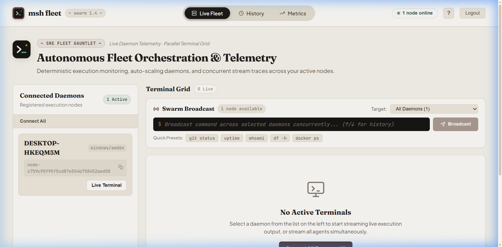

<p align="center">
  
</p>

<h1 align="center">msh: sudo for AI Agents</h1>

<p align="center">
  <b>The local, machine-readable execution runtime, flight recorder, and swarm control plane for LLMs and autonomous coding agents.</b>
</p>

<p align="center">
  <a href="https://github.com/msh-protocol/msh/actions/workflows/ci.yml"></a>
  <a href="https://github.com/msh-protocol/msh/releases"></a>
  <a href="LICENSE"></a>
  <a href="https://pypi.org/project/msh-protocol/"></a>
  <a href="https://www.npmjs.com/package/@msh-protocol/client"></a>
</p>

<p align="center">
  
</p>

---

## Why msh?

When an autonomous AI agent executes terminal commands directly in a raw shell, production workflows break:

1. **Interactive Prompts Hang Indefinitely**: Commands requesting confirmations (`[y/N]`, `password:`, `npm init`, SSH trust) block the process stdin, freezing the agent loop forever.
2. **Context Window Blowouts**: A single compiler dump, stack trace, or pytest failure outputs 30,000 lines, instantly consuming token limits and bankrupting LLM context.
3. **Secret & Key Leakage**: Scripts and build tools print environment variables, AWS tokens, or GitHub keys into stdout, permanently exposing them in model prompt histories.
4. **Workspace Corruption & Build Drift**: Agents produce hallucinated changes, overwrite source files, or delete critical files with no atomic way to reverse patches.
5. **ANSI & Control Sequence Pollution**: Terminal colors, dynamic progress bars, and cursor movements corrupt vector embeddings and degrade model reasoning.

`msh` sits directly between your AI agent harness and the operating system as a protective, deterministic execution runtime and flight recorder.

---

## Core Capabilities at a Glance

| Challenge in Raw Shells | Raw Shell Execution | `msh` Deterministic Runtime |
| :--- | :--- | :--- |
| **Interactive Prompts (`[y/N]`)** | ❌ Process hangs forever | ✅ Auto-answers via policy or signals `blocked` |
| **Compiler Error Dumps** | ❌ Blows 100k token context | ✅ Smart truncation (preserves head + tail) |
| **API Keys & Tokens in Logs** | ❌ Leaked to LLM providers | ✅ Redacted automatically in memory |
| **Hallucinated File Edits** | ❌ Unrecoverable workspace pollution | ✅ Atomic rollback via `msh undo` (git diff inverse) |
| **Compiler / Syntax Errors** | ❌ Unstructured stack traces | ✅ Structured `error_root_cause` extraction |
| **ANSI Escape Codes** | ❌ Corrupts model embeddings | ✅ Stripped to clean plain text |
| **Process Exit Codes** | ⚠️ Shell-dependent | ✅ Strict fidelity across POSIX & Windows |
| **Agent Tool Calling** | ❌ Unstructured text | ✅ Strongly-typed `ExecResponse` JSON |

---

## Quick Start & Installation

### 1. One-Line Install

#### macOS / Linux
```bash
curl -fsSL https://raw.githubusercontent.com/msh-protocol/msh/main/scripts/install.sh | bash
```

#### Windows (PowerShell)
```powershell
irm https://raw.githubusercontent.com/msh-protocol/msh/main/scripts/install.ps1 | iex
```

#### Go Install
```bash
go install github.com/msh-protocol/msh/cmd/msh@latest
```

---

## Usage Modes

### 1. Universal Command Runner (`msh <command>`)

Run any shell command through `msh` simply by prefixing it — no quotes or wrapping subcommands required:

```bash
msh git status
msh npm run build
msh pytest -v
msh cargo test
```

Outputs are automatically sanitized (ANSI stripped), bounded (token blowouts prevented), secret-redacted, and interactive prompts are detected and answered.

#### Optional Execution Flags:
```bash
msh --max-lines 500 git log
msh --timeout 1m python script.py
msh --pty npm test
```

---

### 2. Atomic Workspace Rollbacks (`msh undo`)

The "Undo" button for autonomous AI coding agents. Surgically reverts per-command unified diff patches, restores modified or deleted files, and safely removes newly created files without touching unrelated workspace files:

```bash
# Rollback files modified by the most recent execution
msh undo

# Rollback files modified by a specific run ID
msh undo 42

# Surgically revert only a single file from an execution
msh undo 42 --file src/index.ts
```

---

### 3. Model Context Protocol (MCP) Server

`msh` natively exposes a Model Context Protocol server over standard I/O for Claude Desktop, Cursor, Claude Code, and Windsurf:

```json
{
  "mcpServers": {
    "msh": {
      "command": "msh",
      "args": ["mcp"]
    }
  }
}
```

Your agent harness receives a safe, structured `execute_command` tool that cannot hang on interactive confirmations or leak environment secrets.

---

### 4. Official Python SDK (`pip install msh-protocol`)

```python
from msh import exec

# Execute with automatic secret masking & token truncation
res = exec("npm test", max_output_lines=200)

if res.status == "blocked":
    print(f"Command requested confirmation: {res.prompt_detected}")
elif res.ok:
    print(res.stdout)
else:
    print(f"Failed with exit code {res.exit_code}: {res.stderr}")
    if res.error_root_cause:
        print(f"Root cause in {res.error_root_cause.file}:{res.error_root_cause.line}")
```

#### Drop-in Safe Shell Tool for LangChain, CrewAI, and Claude:
```python
from msh import exec

def safe_shell(command: str) -> str:
    """Execute shell commands safely without ANSI noise, prompt hangs, or secret leaks."""
    res = exec(command, max_output_lines=300)
    if not res.ok:
        return f"Error (exit {res.exit_code}):\n{res.stderr or res.stdout}"
    return res.stdout
```

---

### 5. Official TypeScript SDK (`npm install @msh-protocol/client`)

```typescript
import { exec } from '@msh-protocol/client';

const res = await exec('git status', { maxOutputLines: 200 });

if (res.status === 'success') {
  console.log(res.stdout);
} else {
  console.error(`Command failed with code ${res.exit_code}`);
}
```

---

### 6. Structured JSON Pipelines (`msh exec`)

For direct integration with CLI pipelines and JSON-based autonomous agents:

```bash
msh exec "npm run build" --max-lines 500
```

Returns:
```json
{
  "session_id": "session-8b1c4e...",
  "status": "success",
  "exit_code": 0,
  "cwd": "/workspace/app",
  "stdout": "Build completed successfully.",
  "stderr": "",
  "truncated": false,
  "redacted": ["AWS_SECRET_ACCESS_KEY"],
  "files_changed": ["dist/main.js"],
  "duration_ms": 420
}
```

---

### 7. Cryptographic Run Verification (`msh verify`)

Prove deterministic execution reproducibility for benchmarks, regression audits, and compliance:

```bash
# Re-execute run #42 and evaluate bit-for-bit reproducibility
msh verify 42
```

---

## Observability & Fleet Hub (`msh fleet`)

`msh` includes an embedded, high-density telemetry hub for supervising distributed worker daemons and orchestrating agent swarms across multiple machines:

```bash
msh fleet start
```

Starts an embedded web dashboard (`http://localhost:9000`) built with an authentic vintage literary print aesthetic (Aged Book Paper, Walnut Ink, and Library Sage) featuring:

- **Centralized Swarm Broadcast & Command History**: Dispatch shell commands across all or targeted worker daemons in parallel, complete with shell-grade Up/Down arrow key command history recall.
- **Dedicated Node Fleet Drawer & Roundtrip Ping**: Live worker drawer with daemon hardware specifications, active uptime tickers, and sub-millisecond WebSocket ping testing.
- **Global Keyboard Navigation**: Complete keyboard-first workflow (<kbd>1</kbd>, <kbd>2</kbd>, <kbd>3</kbd> for tabs, <kbd>/</kbd> for broadcast search, <kbd>r</kbd> for telemetry refresh, <kbd>n</kbd> for node drawer, and <kbd>?</kbd> for shortcuts cheatsheet).
- **Parallel Multi-Terminal Grid**: Side-by-side low-latency streaming across workers in a high-density, responsive grid.
- **In-Terminal Log Search & Filter**: Real-time keyword filtering per tile for targeted debugging.
- **Follow Logs ("Tail" vs "Hold")**: Freeze the terminal viewport during active log bursts to inspect historical lines without snapping to bottom.
- **Real-Time Telemetry & Metrics Engine**: Continuous SVG latency sparklines, ranked Top Commands leaderboard with success-rate meters, and categorized failure breakdowns.
- **Visual Git-Style File Diff Drawer**: Dual-gutter line numbering, addition/deletion counters, side-by-side Split vs Unified diff view toggle, binary asset specimen cards with rollback safeguards, and full or single-file surgical rollback (`Revert File` / `Undo Run Changes`).
- **Telemetry Export & Download Chooser**: Multi-format audit log export (`.json`, `.csv`, `.txt`) with native directory selection via `showSaveFilePicker()` and quick-download fallback.
- **Execution History Management**: Individual execution record deletion and one-click history clearing with two-step confirmation safeguards.

---

## Protocol Specification

### Request Fields (`ExecRequest`)

| Field | Type | Default | Description |
|---|---|---|---|
| `command` | `string` | *required* | Shell command line to execute |
| `cwd` | `string` | current dir | Working directory to execute the command in |
| `env` | `object` | `{}` | Key-value environment variables to inject |
| `timeout` | `string` | `30s` | Maximum duration before SIGKILL (e.g. `30s`, `5m`) |
| `max_output_lines` | `integer` | `200` | Max lines to return; preserves head and tail |
| `detect_files` | `boolean` | `true` | Tracks created/modified/deleted files via snapshots |
| `use_pty` | `boolean` | `false` | Runs inside pseudo-terminal for TTY-demanding tools |
| `redact_secrets` | `boolean` | `true` | Masks known tokens (AWS, GitHub, Slack, OpenAI) |
| `prompt_answers` | `string[]` | `[]` | Sequential answers fed to interactive prompts |

### Response Fields (`ExecResponse`)

| Field | Type | Description |
|---|---|---|
| `status` | `string` | `success`, `error`, `timeout`, or `blocked` |
| `exit_code` | `integer` | Exact process exit code |
| `cwd` | `string` | Working directory after command completed |
| `stdout` | `string` | Sanitized stdout with ANSI stripped |
| `stderr` | `string` | Sanitized stderr with ANSI stripped |
| `truncated` | `boolean` | `true` if output exceeded `max_output_lines` |
| `redacted` | `string[]` | Types of detected secrets that were masked |
| `files_changed` | `string[]` | Paths of files created, modified, or deleted |
| `file_diffs` | `object` | Map of file paths to unified git-style diffs |
| `error_root_cause` | `object` | Isolated compiler/runtime root cause (type, message, file, line) |
| `run_hash` | `string` | Cryptographic SHA-256 fingerprint for run verification |
| `duration_ms` | `integer` | Execution duration in milliseconds |
| `prompt_detected` | `string` | Text of prompt if command was blocked |

---

## Evaluation Suite

`msh` includes an automated benchmark evaluating real-world problematic CLI scenarios (`evals/cli_evals_test.go`):

- ANSI color and progress bar stripping
- 10,000-line compiler dumps safely truncated
- Interactive prompt detection (`[y/N]`, password, `npm init`)
- Secret leakage masking (AWS, GitHub PAT, OpenAI keys, RSA private keys)
- Exit code fidelity preservation

Run the evaluations:
```bash
msh go test -v ./evals/...
```

---

## Status

**`v1.4.0` — Production Ready.** Active use across agentic workflows, SRE toolchains, and autonomous harnesses.

---

## License

Apache 2.0 — See [LICENSE](LICENSE) for details.
